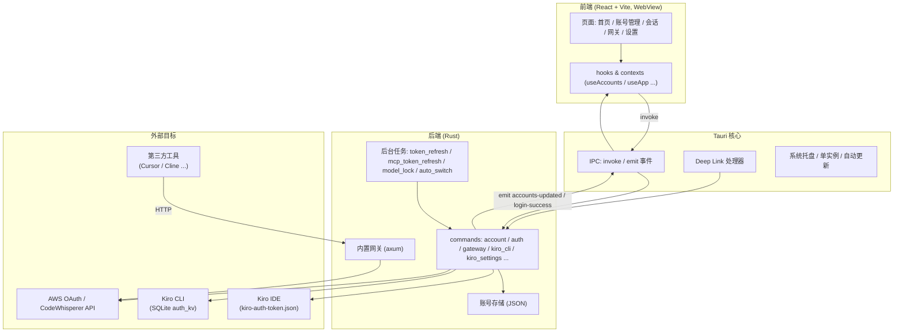
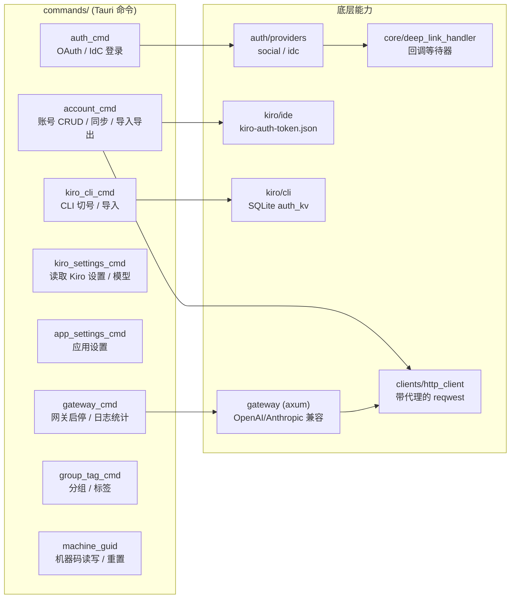
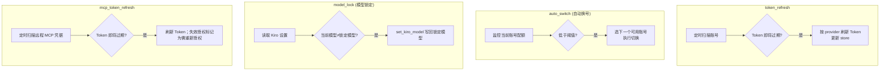
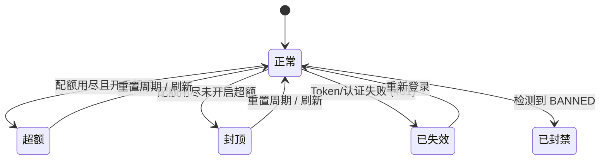
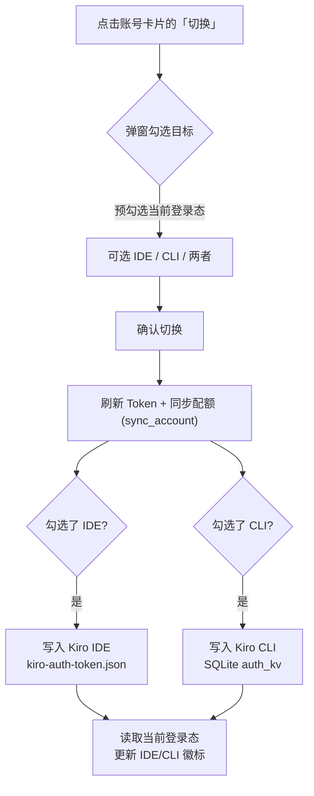
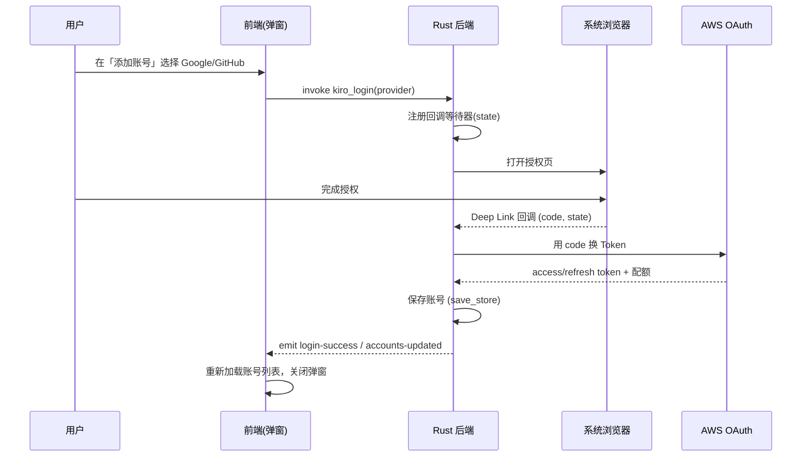
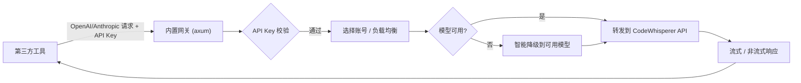

# KiroHub

<p align="center">
  
</p>

<p align="center">
  
  
  
  
  
</p>

<p align="center">
  <b>🚀 集中管理 Kiro IDE / Kiro CLI 账号：一键切号、配额监控、内置 API 网关</b>
</p>

> 🙏 本项目基于原仓库 [hj01857655/kiro-account-manager](https://github.com/hj01857655/kiro-account-manager) 二次开发，衷心感谢原作者的开源贡献。我们仅在其基础上做适配自身需求的个性化定制，核心思路与设计版权归原作者所有。

> 桌面端应用，界面为**简体中文**。基于 Tauri 2.x 构建，前端 React + 后端 Rust。

---

## 📖 目录

- [项目简介](#-项目简介)
- [核心功能](#-核心功能)
- [技术栈](#-技术栈)
- [系统架构](#-系统架构)
- [后台任务](#-后台任务)
- [账号状态](#-账号状态)
- [数据与配置存储](#-数据与配置存储)
- [关键流程](#-关键流程)
- [目录结构](#-目录结构)
- [下载安装](#-下载安装)
- [常见问题](#-常见问题)
- [许可证](#-许可证)

---

## 🏗️ 项目简介

KiroHub 是一个用于集中管理 **Kiro IDE** 与 **Kiro CLI** 账号的桌面应用。它把账号的导入、刷新、验证、切换、配额监控统一到一个界面，并内置一个 OpenAI / Anthropic 兼容的 API 网关，方便第三方工具直接接入。

- **双端登录态**：同一账号可分别登录到 Kiro IDE 与 Kiro CLI，卡片上用 `IDE` / `CLI` 徽标区分，切换时可多选目标。
- **多种登录方式**：Google / GitHub 的 Social OAuth，以及 AWS BuilderId / IAM Identity Center 的 IdC 流程，登录入口集成在「添加账号」弹窗内。
- **自动化**：Token 到期自动刷新、余额不足自动换号、机器码绑定与重置。
- **跨工具历史**：统一浏览 Codex、Claude、Antigravity CLI / IDE 的本地会话记录。
- **MCP 整合**：集中管理 Kiro、Codex、Claude CLI 的 MCP 配置与远程 OAuth 授权。
- **桌面能力**：Deep Link OAuth 回调、单实例、系统托盘、自动更新。

---

## ✨ 核心功能

### 📊 账号管理
- 卡片 / 列表双视图，配额进度条，订阅类型与状态高亮
- 封禁检测、Token 过期倒计时、超额开关
- 标签与分组、高级筛选（订阅类型 / 状态 / 使用率）
- 一键「刷新」：并行拉取配额并刷新 Token

### 🔄 一键切号（IDE / CLI 双目标）
- 切换弹窗可勾选 **IDE**、**CLI**（可同时勾选），按账号当前登录态预勾选
- 无感切换并自动重置 / 绑定机器码
- 封禁账号自动跳过，余额不足自动换号

### 🔐 登录认证
- **Social**：Google / GitHub OAuth（浏览器授权 + Deep Link 回调）
- **IdC**：AWS BuilderId / IAM Identity Center（Enterprise 需填写 Start URL）

### 📦 批量与导入
- JSON 凭证导入、从 Kiro IDE 导入、从 kiro-cli 数据库导入
- 在线登录方式作为「添加账号」弹窗内的一个标签页

### 🗂️ 历史会话管理
- 聚合 Codex、Claude、Antigravity CLI / IDE 的本地历史，按平台、工作目录和会话分层展示
- 支持标题、目录、来源及会话内容搜索，左侧列表可拖动调整宽度
- 预览角色、摘要和 Markdown 内容，支持复制消息或文件路径，并可导出 Markdown / JSON

### 🧩 MCP 工具管理
- 统一查看 Kiro、Codex、Claude CLI 的 MCP 服务器，支持扫描导入、跨客户端复制、启停和删除
- 远程 MCP 支持 OAuth 授权、刷新、撤销及本地代理；授权失效时会明确提示重新授权

### 🌐 内置 Kiro API 网关
- 兼容 Anthropic `/v1/messages`、OpenAI `/v1/responses`、`/v1/chat/completions`
- 模型智能降级、多账号负载均衡、API Key 鉴权、请求日志与统计

### ⚙️ 系统设置
- 通用（自动刷新、自动换号、机器码、浏览器、关闭行为）
- 通知设置
- 关于（应用信息 / 检查更新）

---

## 🧰 技术栈

| 层 | 技术 |
|----|------|
| 前端 | React 19、Vite 8、TailwindCSS 4、shadcn/Radix UI、内置轻量中文 i18n |
| 桌面框架 | Tauri 2.x（WebView2 / WebKitGTK） |
| 后端 | Rust（tauri command）、rusqlite、reqwest、axum（网关） |
| 平台 | Windows / macOS / Linux |

---

## 🧩 系统架构



### 后端模块分层



### Tauri 命令分类（节选）

| 分类 | 代表命令 | 作用 |
|------|----------|------|
| 账号 | `get_accounts` / `sync_account` / `update_account` / `delete_account` | 列表、同步配额、增改删 |
| 导入导出 | `import_accounts` / `export_accounts` / `import_from_kiro_cli` / `read_kiro_accounts` | 多来源导入与导出 |
| 认证 | `kiro_login` / `cancel_kiro_login` / `handle_kiro_social_callback` / `get_supported_providers` | OAuth / IdC 登录与回调 |
| 切号 | `switch_kiro_account`（IDE）/ `switch_to_cli_account`（CLI）/ `rollback_cli_switch` | 双端切换与回滚 |
| Token | `refresh_account_token` / `check_token_status` / `refresh_all_expiring_tokens` | 刷新与过期检测 |
| 机器码 | `get_system_machine_guid` / `reset_system_machine_guid` / `bind_machine_id_to_account` | 机器码绑定 / 重置 |
| 会话 | `list_session_tree` / `load_session` / `export_session` / `delete_session` | 聚合、预览、导出与清理外部会话历史 |
| MCP | `get_mcp_config_by_client` / `mcp_oauth_authorize_for_client` / `mcp_oauth_refresh_for_client` | 多客户端配置与远程 OAuth 管理 |
| 网关 | `start_gateway` / `stop_gateway` / `get_gateway_request_stats` | 网关启停与统计 |
| 设置 | `get_kiro_settings` / `set_kiro_model` / `get_app_settings` / `save_app_settings` | 配置读写 |

---

## 🔁 后台任务

四个常驻后台任务在应用启动时拉起（`setup_app`），按职责刷新账号、MCP 授权和运行状态：



## 🧬 账号状态



## 🗂️ 数据与配置存储

| 数据 | 位置 | 说明 |
|------|------|------|
| 应用账号库 | 应用数据目录下的 JSON store | 本工具统一管理的账号 |
| 应用设置 | `app-settings.json` | 自动刷新 / 换号 / 机器码等 |
| Kiro IDE 登录态 | `~/.aws/sso/cache/kiro-auth-token.json` | IDE 当前账号 |
| Kiro CLI 登录态 | kiro-cli 的 SQLite（`auth_kv` 表） | CLI 当前账号 |
| 网关配置 | gateway 配置文件 | 监听地址 / API Key / 账号策略 |

---

## 🔀 关键流程

### 1）账号切换（IDE / CLI 双目标）



### 2）在线登录（Social OAuth + Deep Link）



### 3）网关请求转发



---

## 📁 目录结构

```text
KiroHub/
├─ src/                      # 前端 (React + Vite)
│  ├─ components/
│  │  ├─ features/           # 业务页面
│  │  │  ├─ Home/            # 首页 / 仪表盘 / MCP 工具管理
│  │  │  ├─ AccountManager/  # 账号管理（卡片/列表、切换、导入弹窗）
│  │  │  ├─ Login/           # 登录方式（嵌入导入弹窗）
│  │  │  ├─ SessionManager/  # Codex / Claude / Antigravity 历史会话管理
│  │  │  ├─ Gateway/         # 内置 API 网关配置
│  │  │  ├─ Layout/          # 整体布局 / 侧边栏
│  │  │  ├─ Settings/        # 设置（通用 / 通知 / 关于）
│  │  │  └─ About/           # 关于（作为设置内的标签页）
│  │  ├─ ui/                 # 通用 UI 组件（shadcn/Radix 封装）
│  │  └─ shared/             # 共享组件（Dialog / Button ...）
│  ├─ hooks/ contexts/       # 状态与逻辑
│  ├─ App.tsx main.tsx       # 应用入口
│  ├─ i18n.tsx               # 国际化（仅简体中文）
│  ├─ routes.tsx             # 路由 / 侧边栏菜单
│  └─ locales/zh-CN.ts       # 中文文案
├─ src-tauri/                # 后端 (Rust + Tauri)
│  ├─ src/
│  │  ├─ commands/           # Tauri 命令（account_cmd/ 等已按域拆分为子目录）
│  │  ├─ auth/               # OAuth / IdC providers、Deep Link 导航
│  │  ├─ core/               # Deep Link 处理器、账号核心
│  │  ├─ kiro/               # Kiro IDE / CLI / 进程集成
│  │  ├─ gateway/            # 内置网关（axum）：converter/ 协议转换、proxy/ 转发
│  │  ├─ mcp_oauth/ mcp_proxy/ # MCP OAuth 与代理
│  │  ├─ clients/            # HTTP 客户端（带代理的 reqwest）
│  │  ├─ db/ models/ services/ # 数据库、数据模型、业务服务及外部会话解析
│  │  ├─ tasks/              # 后台任务（token_refresh、mcp_token_refresh）
│  │  ├─ model_lock.rs       # 模型锁定后台任务
│  │  ├─ auto_switch.rs      # 自动换号后台任务
│  │  ├─ state.rs            # 全局状态
│  │  └─ tray_behavior.rs    # 系统托盘行为
│  └─ tauri.conf.json
└─ package.json
```

---

## 📥 下载安装

| 平台 | 架构 | 文件格式 |
|------|------|---------|
| 🪟 Windows | x64 | `.msi` 安装包 |
| 🍎 macOS | Intel / Apple Silicon | `.dmg` 镜像 |
| 🐧 Linux | x86_64 | `.AppImage` / `.deb` |

**系统要求**：
- **Windows**: Windows 10/11 (64-bit)，需要 [WebView2](https://developer.microsoft.com/microsoft-edge/webview2/)（Win11 已内置）
- **macOS**: macOS 10.15+（Catalina 及以上）
- **Linux**: x86_64，需要 WebKitGTK 4.0+

**安装说明**：
- **Windows**: 双击 `.msi` 安装，支持在现有版本上直接覆盖升级
- **macOS**: 打开 `.dmg` 拖入 Applications；若提示「已损坏」，执行 `xattr -cr /Applications/KiroHub.app`
- **Linux AppImage**: `chmod +x` 后直接运行；**DEB**: `sudo dpkg -i`

---

## ❓ 常见问题

**Q: 切换账号时提示 "bearer token invalid"？**
A: Token 过期了，切换前先点卡片上的「刷新」。

**Q: 一个账号能同时登录 IDE 和 CLI 吗？**
A: 可以。点「切换」后在弹窗里同时勾选 IDE 和 CLI 即可；卡片会用 `IDE` / `CLI` 徽标显示当前登录态。

**Q: 在线登录后账号列表没刷新？**
A: 已修复为登录成功后自动刷新；若仍未刷新，重新进入「账号管理」即可。

**Q: 点击关闭按钮后应用没退出？**
A: 默认隐藏到系统托盘，点托盘菜单「退出应用」可彻底退出（可在设置里改为直接退出）。

**Q: MCP Token 刷新提示 `invalid_grant`？**
A: 这表示远程服务已不再认可旧的授权凭据。应用会将该连接标记为“需重新授权”，在 MCP 工具中重新完成一次 OAuth 授权即可。

**Q: 会话管理里没有显示最新记录？**
A: 点击会话列表顶部的刷新按钮会清除扫描缓存并重新读取 Codex、Claude、Antigravity 的本地历史目录。

---

## 📄 许可证

[CC BY-NC-SA 4.0](LICENSE) — **禁止商业使用**

本项目为基于 [hj01857655/kiro-account-manager](https://github.com/hj01857655/kiro-account-manager) 的演绎作品，依据 CC BY-NC-SA 4.0 协议，沿用相同协议共享并保留原作者署名。

本软件仅供学习交流使用，使用本软件所产生的任何后果由用户自行承担。

---

<p align="center">原作 by hj01857655 · 定制 by lookfeeb</p>
